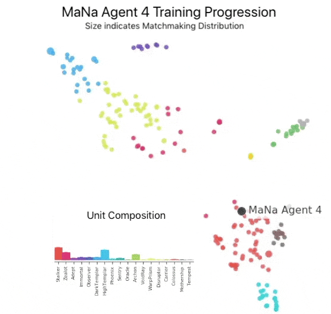

Note: this is the jan 2019 ver which is superseded by the oct 2019 ver [alphastar-final](alphastar-final.md)
# Description of result
AlphaStar, the first Artificial Intelligence to defeat a top professional player. MMR ~ high 7k > 7.5k. cam interface ~ 7.5k

beat [Team Liquid’s](https://www.teamliquid.com/) Grzegorz "[MaNa](https://liquipedia.net/starcraft2/MaNa)" Komincz, [one of the world’s strongest professional StarCraft players](https://liquipedia.net/starcraft2/2018_StarCraft_II_World_Championship_Series_Circuit/Standings), 5-0, following a successful benchmark match against his team-mate Dario “[TLO](https://liquipedia.net/starcraft2/TLO)” Wünsch. 

The matches took place under professional match conditions on a competitive ladder [map](https://liquipedia.net/starcraft2/Catalyst_LE) and without any game restrictions. avg 280 APM

note: alphastar didnt have to move cam, but  On average, agents “switched context” about 30 times per minute, similar to MaNa or TLO. after building one with cam interface, alphastar can still exceed MaNa's MMR but is strictly inferior to the raw interface ver

---
## How it compares to previous work

---
## Main strategies used to obtain results
deep neural network that is trained directly from raw game data by supervised learning and reinforcement learning.
### architecture
 Transformer torso to the units (similar to relational deep reinforcement learning), combined with a deep LSTM core, an auto-regressive policy head with a pointer network, and a centralised value baseline. 
### training
 Neural network was initially trained by supervised learning from anonymised human games released by Blizzard. This allowed AlphaStar to learn, by imitation, the basic micro and macro-strategies used by players on the StarCraft ladder. This initial agent defeated the built-in “Elite” level AI - around gold level for a human player - in 95% of games
#### MARL
 These were then used to seed a multi-agent reinforcement learning process. 
 - A continuous league was created, with the agents of the league - competitors - playing games against each other, akin to how humans experience the game of StarCraft by playing on the StarCraft ladder. 
 - New competitors were dynamically added to the league, by branching from existing competitors; each agent then learns from games against other competitors. 
 - This new form of training takes the ideas of population-based and multi-agent reinforcement learning further, creating a process that continually explores the huge strategic space of StarCraft gameplay, while ensuring that each competitor performs well against the strongest strategies, and does not forget how to defeat earlier ones.
 - As the league progresses and new competitors are created, new counter-strategies emerge that are able to defeat the earlier strategies. While some new competitors execute a strategy that is merely a refinement of a previous strategy, others discover drastically new strategies consisting of entirely new build orders, unit compositions, and micro-management plans. 
	 - For example, early on in the AlphaStar league, “cheesy” strategies such as very quick rushes with Photon Cannons or Dark Templars were favoured. These risky strategies were discarded as training progressed, leading to other strategies: for example, gaining economic strength by over-extending a base with more workers, or sacrificing two Oracles to disrupt an opponent's workers and economy. 
	 - This process is similar to the way in which players have discovered new strategies, and were able to defeat previously favoured approaches, over the years since StarCraft was released.

#### update
The neural network weights of each agent are updated by reinforcement learning from its games against competitors, to optimise its personal learning objective. The weight update rule is an efficient and novel [off-policy actor-critic](https://arxiv.org/pdf/1802.01561.pdf) reinforcement learning algorithm with [experience replay](https://link.springer.com/content/pdf/10.1023%2FA%3A1022628806385.pdf), [self-imitation learning](http://proceedings.mlr.press/v80/oh18b/oh18b.pdf) and [policy distillation](https://arxiv.org/pdf/1511.06295.pdf).

---

## other

The figure shows how one agent (black dot), which was ultimately selected to play against MaNa, evolved its strategy and competitors (coloured dots) during the course of training. Each dot represents a competitor in the AlphaStar league. The position of the dot represents its strategy (inset), and the size of the dot represents how frequently it is selected as an opponent for the MaNa agent during training.

The distribution of AlphaStar’s APMs in its matches against MaNa and TLO and the total delay between observations and actions. CLARIFICATION (29/01/19): TLO’s APM appears higher than both AlphaStar and MaNa because of his use of rapid-fire hot-keys and use of the “remove and add to control group” key bindings. Also note that AlphaStar's effective APM bursts are sometimes higher than both players.

## compute
 - distributed training setup using [Google's v3 TPUs that](https://cloud.google.com/tpu/) supports a population of agents learning from many thousands of parallel instances of StarCraft I
 - AlphaStar league was run for 14 days, using 16 TPUs for each agent. 
 - During training, each agent experienced up to **200 years** of real-time StarCraft play. 
 - The final AlphaStar agent consists of the components of the [Nash distribution of the league](https://papers.nips.cc/paper/7588-re-evaluating-evaluation.pdf) - in other words, the most effective mixture of strategies that have been discovered - that run on a single desktop GPU.

